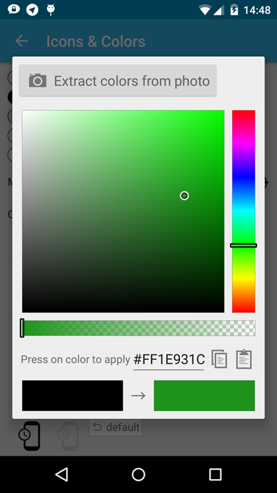
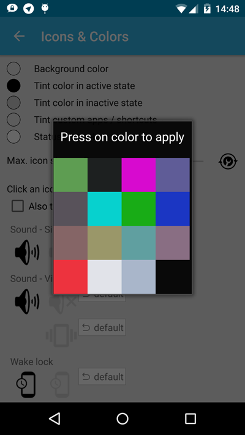

# colorpicker

Fork of [ColorPickerPreference](https://github.com/attenzione/android-ColorPickerPreference)

Improvements:
* extract colors from photo
* copy/paste
* no dialog title

<table sytle="border: 0px;">
<tr>
<td></td>
<td></td>
</tr>
</table>


Usage
-----

Add to your build.gradle:
```
dependencies {
    compile 'com.github.j4velin.colorpicker:colorpicker:+'
}
```

To show the dialog:
```
ColorPickerDialog dialog = new ColorPickerDialog(getActivity(), Color.BLACK);
                dialog.setOnColorChangedListener(new ColorPickerDialog.OnColorChangedListener() {
                    @Override
                    public void onColorChanged(int color) {
                        // apply new color
                    }
                });
                dialog.show();
```
